# AI-Powered HRMS Database Schema

> **Database:** SQLite (via Prisma ORM)  
> **Schema Version:** 1.0.0  
> **Total Models:** 21  
> **Total Tables:** 21

---

## Table of Contents

1. [ER Diagram](#er-diagram)
2. [Core Models](#core-models)
   - [Employee](#employee)
   - [Department](#department)
   - [Role](#role)
3. [Time & Attendance Models](#time--attendance-models)
   - [Attendance](#attendance)
   - [Leave](#leave)
   - [Shift](#shift)
   - [Holiday](#holiday)
4. [Payroll & Finance Models](#payroll--finance-models)
   - [Payroll](#payroll)
   - [Expense](#expense)
5. [Performance & Growth Models](#performance--growth-models)
   - [Performance](#performance)
   - [Skill](#skill)
   - [EmployeeSkill](#employeeskill)
6. [Learning & Development Models](#learning--development-models)
   - [Course](#course)
   - [CourseEnrollment](#courseenrollment)
7. [Asset & Document Models](#asset--document-models)
   - [Asset](#asset)
   - [Document](#document)
8. [Talent Acquisition Models](#talent-acquisition-models)
   - [Job](#job)
   - [Candidate](#candidate)
9. [System & Audit Models](#system--audit-models)
   - [AuditLog](#auditlog)
   - [ApprovalWorkflow](#approvalworkflow)
   - [CompanyPolicy](#companypolicy)
10. [Seed Data Summary](#seed-data-summary)
11. [Index Strategy](#index-strategy)

---

## ER Diagram

```mermaid
erDiagram
    Employee {
        String id PK
        String employeeId UK
        String firstName
        String lastName
        String email UK
        String phone
        String department
        String designation
        String jobTitle
        String contractType
        String status
        Float salary
        DateTime createdAt
        DateTime updatedAt
    }

    Department {
        String id PK
        String name UK
        String head
        Float budget
    }

    Role {
        String id PK
        String name UK
        String permissions
        Int level
    }

    Attendance {
        String id PK
        String employeeId FK
        String date
        String checkIn
        String checkOut
        String status
        String shift
        String location
    }

    Leave {
        String id PK
        String employeeId FK
        String leaveType
        String startDate
        String endDate
        Float days
        String status
        String approvedBy
    }

    Payroll {
        String id PK
        String employeeId FK
        String month
        Int year
        Float basicSalary
        Float grossPay
        Float totalDeductions
        Float netPay
        String status
    }

    Expense {
        String id PK
        String employeeId FK
        String category
        Float amount
        String date
        String status
        String approvedBy
    }

    Performance {
        String id PK
        String employeeId FK
        String reviewPeriod
        String reviewerId
        Float rating
        Float attritionRisk
        String status
    }

    Asset {
        String id PK
        String employeeId FK
        String assetType
        String assetName
        String serialNo
        String status
    }

    Document {
        String id PK
        String employeeId FK
        String docType
        String title
        String accessLevel
    }

    Skill {
        String id PK
        String name UK
        String category
    }

    EmployeeSkill {
        String id PK
        String employeeId FK
        String skillId FK
        String proficiency
        Boolean certified
    }

    Course {
        String id PK
        String title
        String category
        Int duration
        String provider
    }

    CourseEnrollment {
        String id PK
        String employeeId FK
        String courseId FK
        String status
        Float progress
        Float score
    }

    Job {
        String id PK
        String title
        String department
        String location
        String type
        String status
    }

    Candidate {
        String id PK
        String jobId FK
        String name
        String email
        String status
        Float aiFitScore
    }

    AuditLog {
        String id PK
        String userId
        String employeeId FK
        String action
        String module
        String details
    }

    ApprovalWorkflow {
        String id PK
        String type
        String requesterId
        String approverId
        Int level
        String status
    }

    CompanyPolicy {
        String id PK
        String title
        String category
        String content
        String version
    }

    Shift {
        String id PK
        String name
        String startTime
        String endTime
        Int graceTime
    }

    Holiday {
        String id PK
        String name
        String date
        String type
    }

    Employee ||--o{ Attendance : "has"
    Employee ||--o{ Leave : "has"
    Employee ||--o{ Payroll : "has"
    Employee ||--o{ Expense : "has"
    Employee ||--o{ Performance : "has"
    Employee ||--o{ Asset : "owns"
    Employee ||--o{ Document : "has"
    Employee ||--o{ EmployeeSkill : "has"
    Employee ||--o{ CourseEnrollment : "enrolled"
    Employee ||--o{ AuditLog : "generates"
    Skill ||--o{ EmployeeSkill : "assigned to"
    Course ||--o{ CourseEnrollment : "has"
    Job ||--o{ Candidate : "has"
```



---

## Core Models

### Employee

The central model representing all personnel in the organization. Every other domain model (attendance, payroll, leaves, etc.) references this table.

| Column | Type | Constraints | Default | Description |
|--------|------|-------------|---------|-------------|
| `id` | String | **PK**, `@default(cuid())` | Auto-generated | Unique record identifier |
| `employeeId` | String | **UNIQUE**, NOT NULL | — | Business-facing employee ID (e.g., `EMP001`) |
| `firstName` | String | NOT NULL | — | First name |
| `lastName` | String | NOT NULL | — | Last name |
| `email` | String | **UNIQUE**, NOT NULL | — | Email address |
| `phone` | String | nullable | `null` | Phone number |
| `avatar` | String | nullable | `null` | Avatar image URL |
| `dateOfBirth` | String | nullable | `null` | Date of birth (YYYY-MM-DD) |
| `gender` | String | nullable | `null` | Gender |
| `address` | String | nullable | `null` | Residential address |
| `department` | String | nullable | `null` | Department name (denormalized) |
| `designation` | String | nullable | `null` | Designation / role title |
| `jobTitle` | String | nullable | `null` | Job title |
| `contractType` | String | nullable | `null` | `full-time`, `part-time`, `contract`, `intern` |
| `reportingTo` | String | nullable | `null` | Manager's employee ID |
| `joinDate` | String | nullable | `null` | Date of joining (YYYY-MM-DD) |
| `exitDate` | String | nullable | `null` | Date of exit (YYYY-MM-DD) |
| `status` | String | NOT NULL | `"active"` | `active`, `inactive`, `onboarding`, `exited` |
| `salary` | Float | nullable | `null` | Annual salary (INR) |
| `bankAccount` | String | nullable | `null` | Bank account number (masked) |
| `panNumber` | String | nullable | `null` | PAN number |
| `pfNumber` | String | nullable | `null` | Provident Fund number |
| `esiNumber` | String | nullable | `null` | ESI number |
| `emergencyContact` | String | nullable | `null` | Emergency contact number |
| `createdAt` | DateTime | NOT NULL | `now()` | Record creation timestamp |
| `updatedAt` | DateTime | NOT NULL | `@updatedAt` | Last update timestamp |

**Relations:**

| Relation | Target Model | Type | Foreign Key |
|----------|-------------|------|-------------|
| `attendance` | Attendance | One-to-Many | `employeeId` |
| `leaves` | Leave | One-to-Many | `employeeId` |
| `payroll` | Payroll | One-to-Many | `employeeId` |
| `expenses` | Expense | One-to-Many | `employeeId` |
| `performance` | Performance | One-to-Many | `employeeId` |
| `assets` | Asset | One-to-Many | `employeeId` |
| `skills` | EmployeeSkill | One-to-Many | `employeeId` |
| `enrollments` | CourseEnrollment | One-to-Many | `employeeId` |
| `documents` | Document | One-to-Many | `employeeId` |
| `auditLogs` | AuditLog | One-to-Many | `employeeId` |

**Indexes:** `employeeId` (unique), `email` (unique)

---

### Department

Represents organizational departments. Departments are referenced by name (string) in the Employee model rather than by foreign key for simplicity.

| Column | Type | Constraints | Default | Description |
|--------|------|-------------|---------|-------------|
| `id` | String | **PK**, `@default(cuid())` | Auto | Unique identifier |
| `name` | String | **UNIQUE**, NOT NULL | — | Department name |
| `head` | String | nullable | `null` | Department head name |
| `description` | String | nullable | `null` | Department description |
| `budget` | Float | nullable | `null` | Annual budget (INR) |
| `createdAt` | DateTime | NOT NULL | `now()` | Creation timestamp |
| `updatedAt` | DateTime | NOT NULL | `@updatedAt` | Update timestamp |

---

### Role

Defines RBAC roles with granular permissions stored as a JSON string. Each role has a hierarchical level.

| Column | Type | Constraints | Default | Description |
|--------|------|-------------|---------|-------------|
| `id` | String | **PK**, `@default(cuid())` | Auto | Unique identifier |
| `name` | String | **UNIQUE**, NOT NULL | — | Role name |
| `description` | String | nullable | `null` | Role description |
| `permissions` | String | nullable | `null` | JSON string of permissions per module |
| `level` | Int | NOT NULL | `0` | Hierarchy level (0 = highest) |
| `createdAt` | DateTime | NOT NULL | `now()` | Creation timestamp |
| `updatedAt` | DateTime | NOT NULL | `@updatedAt` | Update timestamp |

**Permissions JSON Structure:**

```json
{
  "HR": { "read": true, "write": true, "modify": true, "delete": false, "admin": false },
  "Payroll": { "read": true, "write": true, "modify": true, "delete": false, "admin": false },
  "Attendance": { "read": true, "write": false, "modify": false, "delete": false, "admin": false },
  "Performance": { "read": true, "write": true, "modify": true, "delete": false, "admin": false },
  "Learning": { "read": true, "write": false, "modify": false, "delete": false, "admin": false },
  "Analytics": { "read": true, "write": false, "modify": false, "delete": false, "admin": false }
}
```

---

## Time & Attendance Models

### Attendance

Tracks daily employee attendance including check-in/out times, status, and location.

| Column | Type | Constraints | Default | Description |
|--------|------|-------------|---------|-------------|
| `id` | String | **PK**, `@default(cuid())` | Auto | Unique identifier |
| `employeeId` | String | **FK** → Employee.id, NOT NULL | — | Employee reference |
| `date` | String | NOT NULL | — | Attendance date (YYYY-MM-DD) |
| `checkIn` | String | nullable | `null` | Check-in time (HH:mm) |
| `checkOut` | String | nullable | `null` | Check-out time (HH:mm) |
| `status` | String | NOT NULL | `"present"` | `present`, `absent`, `late`, `half-day` |
| `shift` | String | nullable | `null` | `morning`, `evening`, `night` |
| `location` | String | nullable | `null` | Check-in location |
| `notes` | String | nullable | `null` | Additional notes |
| `createdAt` | DateTime | NOT NULL | `now()` | Creation timestamp |
| `updatedAt` | DateTime | NOT NULL | `@updatedAt` | Update timestamp |

**Business Rules:**
- One attendance record per employee per date (enforced at API level, returns `409` on duplicate)
- `checkOut` should be after `checkIn` when both are present

---

### Leave

Manages employee leave requests with approval workflow.

| Column | Type | Constraints | Default | Description |
|--------|------|-------------|---------|-------------|
| `id` | String | **PK**, `@default(cuid())` | Auto | Unique identifier |
| `employeeId` | String | **FK** → Employee.id, NOT NULL | — | Employee reference |
| `leaveType` | String | NOT NULL | — | `casual`, `sick`, `earned`, `maternity`, `paternity` |
| `startDate` | String | NOT NULL | — | Leave start date (YYYY-MM-DD) |
| `endDate` | String | NOT NULL | — | Leave end date (YYYY-MM-DD) |
| `days` | Float | NOT NULL | — | Number of leave days (supports half-days) |
| `reason` | String | nullable | `null` | Reason for leave |
| `status` | String | NOT NULL | `"pending"` | `pending`, `approved`, `rejected` |
| `approvedBy` | String | nullable | `null` | Approver name/ID |
| `comments` | String | nullable | `null` | Approval/rejection comments |
| `createdAt` | DateTime | NOT NULL | `now()` | Creation timestamp |
| `updatedAt` | DateTime | NOT NULL | `@updatedAt` | Update timestamp |

**Business Rules:**
- New leaves always start with `status: "pending"`
- Once approved or rejected, status cannot be changed again (returns `409`)
- Only `pending` leaves can be approved or rejected via the PATCH endpoint

---

### Shift

Defines work shift schedules with timing and grace periods.

| Column | Type | Constraints | Default | Description |
|--------|------|-------------|---------|-------------|
| `id` | String | **PK**, `@default(cuid())` | Auto | Unique identifier |
| `name` | String | NOT NULL | — | Shift name (e.g., "Morning Shift") |
| `startTime` | String | NOT NULL | — | Shift start time (HH:mm) |
| `endTime` | String | NOT NULL | — | Shift end time (HH:mm) |
| `graceTime` | Int | nullable | `null` | Grace period in minutes |
| `createdAt` | DateTime | NOT NULL | `now()` | Creation timestamp |
| `updatedAt` | DateTime | NOT NULL | `@updatedAt` | Update timestamp |

---

### Holiday

Tracks company and national holidays.

| Column | Type | Constraints | Default | Description |
|--------|------|-------------|---------|-------------|
| `id` | String | **PK**, `@default(cuid())` | Auto | Unique identifier |
| `name` | String | NOT NULL | — | Holiday name |
| `date` | String | NOT NULL | — | Holiday date (YYYY-MM-DD) |
| `type` | String | nullable | `null` | `national`, `company`, `optional` |
| `createdAt` | DateTime | NOT NULL | `now()` | Creation timestamp |
| `updatedAt` | DateTime | NOT NULL | `@updatedAt` | Update timestamp |

---

## Payroll & Finance Models

### Payroll

Stores monthly payroll records with detailed salary breakdown. Auto-calculates components when not explicitly provided.

| Column | Type | Constraints | Default | Description |
|--------|------|-------------|---------|-------------|
| `id` | String | **PK**, `@default(cuid())` | Auto | Unique identifier |
| `employeeId` | String | **FK** → Employee.id, NOT NULL | — | Employee reference |
| `month` | String | NOT NULL | — | Month name (e.g., `"January"`) |
| `year` | Int | NOT NULL | — | Year (e.g., `2024`) |
| `basicSalary` | Float | NOT NULL | — | Basic salary component |
| `hra` | Float | NOT NULL | — | House Rent Allowance |
| `da` | Float | NOT NULL | — | Dearness Allowance |
| `conveyance` | Float | NOT NULL | — | Conveyance allowance |
| `medical` | Float | NOT NULL | — | Medical allowance |
| `bonus` | Float | NOT NULL | `0` | Bonus amount |
| `grossPay` | Float | NOT NULL | — | Gross pay (sum of earnings) |
| `pf` | Float | NOT NULL | — | Provident Fund deduction |
| `esi` | Float | NOT NULL | — | Employee State Insurance |
| `tax` | Float | NOT NULL | — | Income Tax deduction |
| `professionalTax` | Float | NOT NULL | — | Professional Tax |
| `totalDeductions` | Float | NOT NULL | — | Sum of all deductions |
| `netPay` | Float | NOT NULL | — | Net pay (grossPay - totalDeductions) |
| `status` | String | NOT NULL | `"processed"` | `processed`, `paid`, `pending` |
| `createdAt` | DateTime | NOT NULL | `now()` | Creation timestamp |
| `updatedAt` | DateTime | NOT NULL | `@updatedAt` | Update timestamp |

**Calculation Defaults (when not explicitly provided):**

| Component | Default Formula |
|-----------|----------------|
| `hra` | `basicSalary × 0.40` |
| `da` | `basicSalary × 0.10` |
| `conveyance` | `1600` |
| `medical` | `1250` |
| `pf` | `basicSalary × 0.12` |
| `esi` | `grossPay × 0.0075` |
| `professionalTax` | `200` |
| `grossPay` | `basicSalary + hra + da + conveyance + medical + bonus` |
| `totalDeductions` | `pf + esi + tax + professionalTax` |
| `netPay` | `grossPay - totalDeductions` |

**Business Rules:**
- One payroll record per employee per month/year (returns `409` on duplicate)
- Employee must exist (returns `404` if not found)
- `basicSalary` defaults to `employee.salary / 12` if not provided

---

### Expense

Manages employee expense claims with approval and reimbursement workflow.

| Column | Type | Constraints | Default | Description |
|--------|------|-------------|---------|-------------|
| `id` | String | **PK**, `@default(cuid())` | Auto | Unique identifier |
| `employeeId` | String | **FK** → Employee.id, NOT NULL | — | Employee reference |
| `category` | String | NOT NULL | — | `travel`, `food`, `accommodation`, `equipment`, `other` |
| `amount` | Float | NOT NULL | — | Expense amount (INR) |
| `description` | String | nullable | `null` | Expense description |
| `receiptUrl` | String | nullable | `null` | URL to uploaded receipt |
| `date` | String | NOT NULL | — | Expense date (YYYY-MM-DD) |
| `status` | String | NOT NULL | `"pending"` | `pending`, `approved`, `rejected`, `reimbursed` |
| `approvedBy` | String | nullable | `null` | Approver name/ID |
| `comments` | String | nullable | `null` | Approval/rejection comments |
| `createdAt` | DateTime | NOT NULL | `now()` | Creation timestamp |
| `updatedAt` | DateTime | NOT NULL | `@updatedAt` | Update timestamp |

**Status Flow:**

```
pending ──► approved ──► reimbursed
   │
   └──────► rejected (terminal state)
```

- `rejected` expenses cannot be updated further
- `reimbursed` requires `approved` status first

---

## Performance & Growth Models

### Performance

Stores employee performance reviews with ratings, objectives, and attrition risk analysis.

| Column | Type | Constraints | Default | Description |
|--------|------|-------------|---------|-------------|
| `id` | String | **PK**, `@default(cuid())` | Auto | Unique identifier |
| `employeeId` | String | **FK** → Employee.id, NOT NULL | — | Employee being reviewed |
| `reviewPeriod` | String | NOT NULL | — | Review period (e.g., `"Q4 2023"`) |
| `reviewerId` | String | nullable | `null` | Reviewer employee ID |
| `rating` | Float | NOT NULL | `0` | Performance rating (0-5) |
| `objectives` | String | nullable | `null` | JSON string of OKRs |
| `achievements` | String | nullable | `null` | Key achievements |
| `feedback` | String | nullable | `null` | Manager feedback |
| `selfReview` | String | nullable | `null` | Employee self-assessment |
| `goals` | String | nullable | `null` | Goals for next period |
| `attritionRisk` | Float | NOT NULL | `0` | Attrition risk score (0.0-1.0) |
| `status` | String | NOT NULL | `"draft"` | `draft`, `in-review`, `completed` |
| `createdAt` | DateTime | NOT NULL | `now()` | Creation timestamp |
| `updatedAt` | DateTime | NOT NULL | `@updatedAt` | Update timestamp |

---

### Skill

Master list of skills available in the organization.

| Column | Type | Constraints | Default | Description |
|--------|------|-------------|---------|-------------|
| `id` | String | **PK**, `@default(cuid())` | Auto | Unique identifier |
| `name` | String | **UNIQUE**, NOT NULL | — | Skill name |
| `category` | String | nullable | `null` | Skill category |
| `description` | String | nullable | `null` | Skill description |
| `createdAt` | DateTime | NOT NULL | `now()` | Creation timestamp |
| `updatedAt` | DateTime | NOT NULL | `@updatedAt` | Update timestamp |

---

### EmployeeSkill

Junction table mapping employees to their skills with proficiency levels.

| Column | Type | Constraints | Default | Description |
|--------|------|-------------|---------|-------------|
| `id` | String | **PK**, `@default(cuid())` | Auto | Unique identifier |
| `employeeId` | String | **FK** → Employee.id, NOT NULL | — | Employee reference |
| `skillId` | String | **FK** → Skill.id (implicit), NOT NULL | — | Skill reference |
| `proficiency` | String | nullable | `null` | `beginner`, `intermediate`, `advanced`, `expert` |
| `certified` | Boolean | NOT NULL | `false` | Whether the employee is certified |
| `createdAt` | DateTime | NOT NULL | `now()` | Creation timestamp |
| `updatedAt` | DateTime | NOT NULL | `@updatedAt` | Update timestamp |

> **Note:** `skillId` references Skill.id logically but is not declared as a Prisma relation. The `EmployeeSkill` model includes a relation to `Employee` only. The skill details are fetched via `include: { skill: true }` through a manual join in the API layer.

---

## Learning & Development Models

### Course

Available training courses for employee development.

| Column | Type | Constraints | Default | Description |
|--------|------|-------------|---------|-------------|
| `id` | String | **PK**, `@default(cuid())` | Auto | Unique identifier |
| `title` | String | NOT NULL | — | Course title |
| `description` | String | nullable | `null` | Course description |
| `category` | String | nullable | `null` | Course category |
| `duration` | Int | nullable | `null` | Duration in hours |
| `provider` | String | nullable | `null` | Course provider |
| `url` | String | nullable | `null` | Course URL |
| `skills` | String | nullable | `null` | JSON array of skill IDs |
| `createdAt` | DateTime | NOT NULL | `now()` | Creation timestamp |
| `updatedAt` | DateTime | NOT NULL | `@updatedAt` | Update timestamp |

---

### CourseEnrollment

Tracks employee enrollment and progress in courses.

| Column | Type | Constraints | Default | Description |
|--------|------|-------------|---------|-------------|
| `id` | String | **PK**, `@default(cuid())` | Auto | Unique identifier |
| `employeeId` | String | **FK** → Employee.id, NOT NULL | — | Employee reference |
| `courseId` | String | **FK** → Course.id, NOT NULL | — | Course reference |
| `status` | String | NOT NULL | `"enrolled"` | `enrolled`, `in-progress`, `completed`, `dropped` |
| `progress` | Float | NOT NULL | `0` | Progress percentage (0-100) |
| `score` | Float | nullable | `null` | Final score |
| `completedAt` | String | nullable | `null` | Completion date (YYYY-MM-DD) |
| `createdAt` | DateTime | NOT NULL | `now()` | Creation timestamp |
| `updatedAt` | DateTime | NOT NULL | `@updatedAt` | Update timestamp |

**Relations:**

| Relation | Target Model | Type | Foreign Key |
|----------|-------------|------|-------------|
| `employee` | Employee | Many-to-One | `employeeId` |
| `course` | Course | Many-to-One | `courseId` |

---

## Asset & Document Models

### Asset

Tracks company assets assigned to employees.

| Column | Type | Constraints | Default | Description |
|--------|------|-------------|---------|-------------|
| `id` | String | **PK**, `@default(cuid())` | Auto | Unique identifier |
| `employeeId` | String | **FK** → Employee.id, NOT NULL | — | Employee reference |
| `assetType` | String | NOT NULL | — | `laptop`, `phone`, `access-card`, `peripheral`, `other` |
| `assetName` | String | NOT NULL | — | Asset name/description |
| `serialNo` | String | nullable | `null` | Serial number |
| `assignedDate` | String | nullable | `null` | Assignment date (YYYY-MM-DD) |
| `returnDate` | String | nullable | `null` | Return date (YYYY-MM-DD) |
| `condition` | String | nullable | `null` | `new`, `good`, `fair`, `damaged` |
| `status` | String | NOT NULL | `"assigned"` | `assigned`, `returned`, `lost` |
| `createdAt` | DateTime | NOT NULL | `now()` | Creation timestamp |
| `updatedAt` | DateTime | NOT NULL | `@updatedAt` | Update timestamp |

---

### Document

Stores employee document references with access control.

| Column | Type | Constraints | Default | Description |
|--------|------|-------------|---------|-------------|
| `id` | String | **PK**, `@default(cuid())` | Auto | Unique identifier |
| `employeeId` | String | **FK** → Employee.id, NOT NULL | — | Employee reference |
| `docType` | String | NOT NULL | — | `contract`, `policy`, `certificate`, `id-proof`, `other` |
| `title` | String | NOT NULL | — | Document title |
| `fileUrl` | String | nullable | `null` | URL to document file |
| `accessLevel` | String | nullable | `null` | `public`, `hr-only`, `manager`, `private` |
| `uploadedBy` | String | nullable | `null` | Uploader name/ID |
| `createdAt` | DateTime | NOT NULL | `now()` | Creation timestamp |
| `updatedAt` | DateTime | NOT NULL | `@updatedAt` | Update timestamp |

---

## Talent Acquisition Models

### Job

Represents open and closed job postings.

| Column | Type | Constraints | Default | Description |
|--------|------|-------------|---------|-------------|
| `id` | String | **PK**, `@default(cuid())` | Auto | Unique identifier |
| `title` | String | NOT NULL | — | Job title |
| `department` | String | nullable | `null` | Department |
| `location` | String | nullable | `null` | Work location |
| `type` | String | nullable | `null` | `full-time`, `part-time`, `contract`, `remote` |
| `experience` | String | nullable | `null` | Required experience |
| `salary` | String | nullable | `null` | Salary range (string for flexibility) |
| `description` | String | nullable | `null` | Job description |
| `requirements` | String | nullable | `null` | JSON array of requirements |
| `skills` | String | nullable | `null` | JSON array of required skills |
| `status` | String | NOT NULL | `"open"` | `open`, `closed`, `on-hold` |
| `postedDate` | String | nullable | `null` | Posting date (YYYY-MM-DD) |
| `closingDate` | String | nullable | `null` | Closing date (YYYY-MM-DD) |
| `createdAt` | DateTime | NOT NULL | `now()` | Creation timestamp |
| `updatedAt` | DateTime | NOT NULL | `@updatedAt` | Update timestamp |

**Relations:**

| Relation | Target Model | Type | Foreign Key |
|----------|-------------|------|-------------|
| `candidates` | Candidate | One-to-Many | `jobId` |

---

### Candidate

Job applicants with AI-powered fit scoring and pipeline tracking.

| Column | Type | Constraints | Default | Description |
|--------|------|-------------|---------|-------------|
| `id` | String | **PK**, `@default(cuid())` | Auto | Unique identifier |
| `jobId` | String | **FK** → Job.id, NOT NULL | — | Job reference |
| `name` | String | NOT NULL | — | Candidate name |
| `email` | String | NOT NULL | — | Candidate email |
| `phone` | String | nullable | `null` | Phone number |
| `resumeUrl` | String | nullable | `null` | Resume file URL |
| `currentCompany` | String | nullable | `null` | Current company |
| `experience` | String | nullable | `null` | Years of experience |
| `skills` | String | nullable | `null` | JSON array of skills |
| `education` | String | nullable | `null` | Education details |
| `source` | String | nullable | `null` | `referral`, `portal`, `linkedin`, `other` |
| `status` | String | NOT NULL | `"applied"` | `applied`, `screening`, `interview`, `offered`, `hired`, `rejected` |
| `aiFitScore` | Float | nullable | `null` | AI-calculated fitness score (0-100) |
| `interviewDate` | String | nullable | `null` | Scheduled interview date |
| `interviewNotes` | String | nullable | `null` | Interview feedback |
| `onboardingStatus` | String | nullable | `null` | `pending`, `in-progress`, `completed` |
| `createdAt` | DateTime | NOT NULL | `now()` | Creation timestamp |
| `updatedAt` | DateTime | NOT NULL | `@updatedAt` | Update timestamp |

**Candidate Pipeline:**

```
applied ──► screening ──► interview ──► offered ──► hired
                │              │
                └──────────────┴──► rejected
```

---

## System & Audit Models

### AuditLog

Comprehensive audit trail for all system actions. Automatically created by API endpoints.

| Column | Type | Constraints | Default | Description |
|--------|------|-------------|---------|-------------|
| `id` | String | **PK**, `@default(cuid())` | Auto | Unique identifier |
| `userId` | String | nullable | `null` | User who performed the action |
| `employeeId` | String | **FK** → Employee.id (nullable) | `null` | Related employee |
| `action` | String | NOT NULL | — | `create`, `read`, `update`, `delete`, `login`, `logout` |
| `module` | String | NOT NULL | — | `hr`, `payroll`, `attendance`, `leave`, `expense`, `performance`, `recruitment`, `learning` |
| `details` | String | nullable | `null` | Human-readable description |
| `ipAddress` | String | nullable | `null` | Client IP address |
| `createdAt` | DateTime | NOT NULL | `now()` | Action timestamp |

**Relation:** `employee` → Employee (optional — some audit logs relate to non-employee actions like job creation)

---

### ApprovalWorkflow

Generic approval workflow supporting multiple entity types (leaves, expenses, promotions).

| Column | Type | Constraints | Default | Description |
|--------|------|-------------|---------|-------------|
| `id` | String | **PK**, `@default(cuid())` | Auto | Unique identifier |
| `type` | String | NOT NULL | — | `leave`, `expense`, `promotion` |
| `requesterId` | String | NOT NULL | — | Requester employee ID |
| `approverId` | String | NOT NULL | — | Approver employee ID |
| `level` | Int | NOT NULL | `1` | Approval level (for multi-level approvals) |
| `status` | String | NOT NULL | `"pending"` | `pending`, `approved`, `rejected` |
| `comments` | String | nullable | `null` | Approval/rejection comments |
| `createdAt` | DateTime | NOT NULL | `now()` | Creation timestamp |
| `updatedAt` | DateTime | NOT NULL | `@updatedAt` | Update timestamp |

---

### CompanyPolicy

Stores company policies and documents with versioning.

| Column | Type | Constraints | Default | Description |
|--------|------|-------------|---------|-------------|
| `id` | String | **PK**, `@default(cuid())` | Auto | Unique identifier |
| `title` | String | NOT NULL | — | Policy title |
| `category` | String | nullable | `null` | Policy category |
| `content` | String | nullable | `null` | Policy content (markdown/text) |
| `version` | String | nullable | `null` | Version number |
| `effectiveDate` | String | nullable | `null` | Effective date (YYYY-MM-DD) |
| `createdAt` | DateTime | NOT NULL | `now()` | Creation timestamp |
| `updatedAt` | DateTime | NOT NULL | `@updatedAt` | Update timestamp |

---

## Seed Data Summary

The seed script (`prisma/seed.ts`) populates the database with realistic sample data:

| Model | Seed Count | Key Data |
|-------|-----------|----------|
| **Shift** | 4 | Morning (09:00-18:00), Evening (14:00-22:00), Night (22:00-06:00), General (10:00-19:00) |
| **Department** | 8 | Engineering, HR, Finance, Marketing, Sales, Operations, Product, Customer Support |
| **Role** | 7 | Super Admin, HR Admin, Payroll Specialist, Department Manager, Employee, Recruiter, L&D Manager |
| **Employee** | 20 | EMP001-EMP020 across all departments; includes active (17), inactive (1), onboarding (1), exited (1); contract types: full-time, part-time, contract, intern |
| **Skill** | 15 | React, Node.js, Python, AWS, ML, Project Mgmt, Data Analysis, Leadership, TypeScript, Docker, Kubernetes, SQL, Communication, Digital Marketing, Financial Analysis |
| **EmployeeSkill** | 14 | Mapped across key employees with proficiency levels and certifications |
| **Attendance** | 8 | Mix of present, late, absent, half-day records across shifts |
| **Leave** | 6 | Casual, sick, earned, maternity leaves with various statuses |
| **Payroll** | 5 | January 2024 payroll with full breakdown (paid, processed, pending) |
| **Expense** | 5 | Travel, accommodation, equipment, food claims with various statuses |
| **Performance** | 6 | Q4 2023 reviews with ratings (3.8-4.7) and attrition risk scores |
| **Asset** | 6 | Laptops, phones, access cards in various conditions |
| **Document** | 8 | ID proofs, contracts, certificates with access levels |
| **Course** | 8 | Engineering, Data Science, Management, Cloud, Marketing, Finance, Soft Skills, DevOps |
| **CourseEnrollment** | 5 | Various statuses: enrolled, in-progress, completed with scores |
| **Job** | 5 | Full Stack Dev, Data Scientist, Marketing Coordinator, HR Executive, DevOps Engineer |
| **Candidate** | 5 | Various pipeline stages with AI fit scores (72-92) |
| **CompanyPolicy** | 3 | Leave Policy, Expense Policy, Code of Conduct |
| **Holiday** | 12 | National and company holidays for 2024 |
| **ApprovalWorkflow** | 3 | Sample approval workflows |

**Total seed records:** ~140+

---

## Index Strategy

### Unique Constraints

| Model | Field | Constraint |
|-------|-------|-----------|
| Employee | `employeeId` | `@unique` |
| Employee | `email` | `@unique` |
| Department | `name` | `@unique` |
| Role | `name` | `@unique` |
| Skill | `name` | `@unique` |

### Recommended Query Indexes (for Production)

For production deployments with larger datasets, consider adding the following indexes:

```sql
-- Employee queries
CREATE INDEX idx_employee_department ON Employee(department);
CREATE INDEX idx_employee_status ON Employee(status);

-- Attendance queries
CREATE INDEX idx_attendance_employee_date ON Attendance(employeeId, date);
CREATE INDEX idx_attendance_date ON Attendance(date);
CREATE INDEX idx_attendance_status ON Attendance(status);

-- Leave queries
CREATE INDEX idx_leave_employee ON Leave(employeeId);
CREATE INDEX idx_leave_status ON Leave(status);

-- Payroll queries
CREATE INDEX idx_payroll_employee_month_year ON Payroll(employeeId, month, year);
CREATE INDEX idx_payroll_status ON Payroll(status);

-- Expense queries
CREATE INDEX idx_expense_employee ON Expense(employeeId);
CREATE INDEX idx_expense_status ON Expense(status);
CREATE INDEX idx_expense_category ON Expense(category);

-- Audit log queries
CREATE INDEX idx_auditlog_module ON AuditLog(module);
CREATE INDEX idx_auditlog_action ON AuditLog(action);
CREATE INDEX idx_auditlog_employee ON AuditLog(employeeId);
CREATE INDEX idx_auditlog_created ON AuditLog(createdAt);

-- Candidate queries
CREATE INDEX idx_candidate_job ON Candidate(jobId);
CREATE INDEX idx_candidate_status ON Candidate(status);

-- Course enrollment queries
CREATE INDEX idx_enrollment_employee ON CourseEnrollment(employeeId);
CREATE INDEX idx_enrollment_course ON CourseEnrollment(courseId);
```

---

## Data Type Reference

| Prisma Type | SQLite Type | JavaScript Type | Description |
|-------------|-----------|----------------|-------------|
| `String` | TEXT | `string` | Variable-length text |
| `Int` | INTEGER | `number` | 32-bit integer |
| `Float` | REAL | `number` | 64-bit floating point |
| `Boolean` | INTEGER | `boolean` | 0 or 1 |
| `DateTime` | TEXT (ISO 8601) | `Date` | ISO datetime string |

---

## Migration Commands

```bash
# Create a new migration after schema changes
npx prisma migrate dev --name description_of_change

# Apply all pending migrations
npx prisma migrate deploy

# Reset database and apply all migrations + seed
npx prisma migrate reset

# Generate Prisma Client after schema changes
npx prisma generate

# Seed the database
npx prisma db seed

# View database in Prisma Studio
npx prisma studio
```
