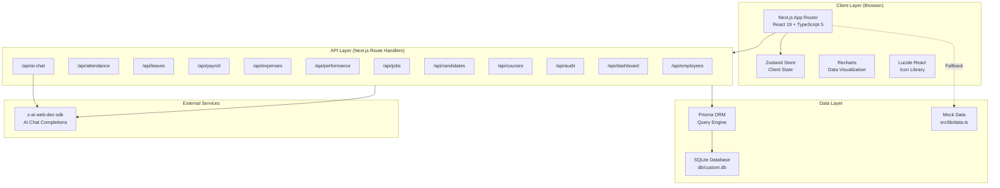
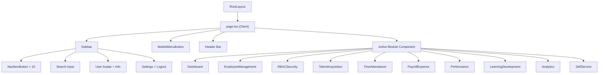
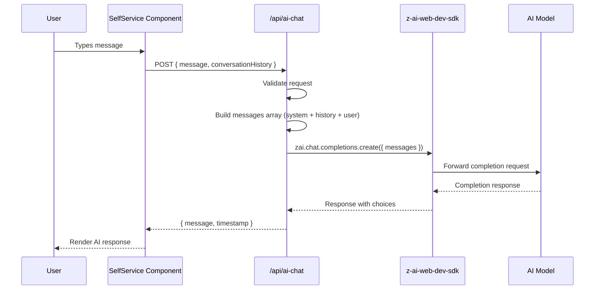
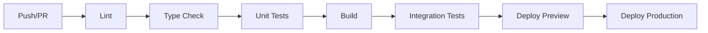

# AI-HRMS — Developer Technical Documentation

> **AI-Powered Human Resource Management System**
> Version 0.2.0 | Last Updated: 2025-03-04

---

## Table of Contents

1. [Architecture Overview](#1-architecture-overview)
2. [Project Structure](#2-project-structure)
3. [Technology Stack](#3-technology-stack)
4. [Database Schema](#4-database-schema)
5. [API Reference](#5-api-reference)
6. [Component Architecture](#6-component-architecture)
7. [Authentication & Authorization](#7-authentication--authorization)
8. [AI Integration](#8-ai-integration)
9. [State Management](#9-state-management)
10. [Styling System](#10-styling-system)
11. [Testing Strategy](#11-testing-strategy)
12. [Deployment Guide](#12-deployment-guide)
13. [CI/CD Pipeline](#13-cicd-pipeline)
14. [Environment Variables](#14-environment-variables)
15. [Contributing Guidelines](#15-contributing-guidelines)
16. [Code Style Guide](#16-code-style-guide)

---

## 1. Architecture Overview

### 1.1 System Architecture Diagram



### 1.2 Data Flow

The application follows a **unidirectional data flow** pattern:

1. **User Interaction** — The user interacts with a module component rendered via the active module registry in `page.tsx`.
2. **State Update** — User actions dispatch Zustand store updates (`setActiveModule`, `setSidebarOpen`, `setSearchQuery`).
3. **API Request** — Components invoke REST API endpoints via `fetch()` to read or mutate server-side data.
4. **Server Processing** — Route handlers execute Prisma queries against SQLite, perform validation, and create audit log entries.
5. **Response Rendering** — JSON responses are consumed by components to render UI with Recharts visualizations and shadcn/ui data tables.
6. **AI Augmentation** — The `/api/ai-chat` endpoint proxies user messages to the `z-ai-web-dev-sdk` for conversational HR assistance, with full conversation history support.

### 1.3 Rendering Strategy

| Path | Strategy | Rationale |
|------|----------|-----------|
| `/` (main page) | Client-side rendering (`'use client'`) | Dynamic module switching requires client-side interactivity |
| `/api/*` | Server-side (Route Handlers) | Direct Prisma access, no client DB exposure |
| Layout | Server Component | Static shell with fonts, metadata, and toaster |

---

## 2. Project Structure

```
my-project/
├── prisma/
│   ├── schema.prisma              # Database schema (21 models)
│   └── seed.ts                    # Database seeder script
├── db/
│   └── custom.db                  # SQLite database file
├── public/
│   ├── logo.svg                   # Application logo
│   └── robots.txt                 # Search engine directives
├── src/
│   ├── app/
│   │   ├── layout.tsx             # Root layout (Server Component)
│   │   ├── page.tsx               # Main SPA entry (Client Component)
│   │   ├── globals.css            # Global styles + CSS variables
│   │   └── api/
│   │       ├── route.ts           # API root handler
│   │       ├── ai-chat/route.ts   # AI chatbot endpoint
│   │       ├── audit/route.ts     # Audit log read endpoint
│   │       ├── attendance/route.ts
│   │       ├── candidates/route.ts
│   │       ├── courses/route.ts
│   │       ├── dashboard/route.ts # Dashboard aggregation endpoint
│   │       ├── employees/
│   │       │   ├── route.ts       # Employee CRUD (list, create)
│   │       │   └── [id]/route.ts  # Single employee (get, update, delete)
│   │       ├── expenses/route.ts
│   │       ├── jobs/route.ts
│   │       ├── leaves/route.ts
│   │       ├── payroll/route.ts
│   │       └── performance/route.ts
│   ├── components/
│   │   ├── hrms/                  # Business logic components
│   │   │   ├── Analytics.tsx      # Analytics & Reporting module
│   │   │   ├── Dashboard.tsx      # Dashboard overview module
│   │   │   ├── EmployeeManagement.tsx
│   │   │   ├── LearningDevelopment.tsx
│   │   │   ├── PayrollExpense.tsx
│   │   │   ├── Performance.tsx
│   │   │   ├── RBACSecurity.tsx
│   │   │   ├── SelfService.tsx    # Employee self-service + AI chat
│   │   │   ├── Sidebar.tsx        # Navigation sidebar
│   │   │   ├── TalentAcquisition.tsx
│   │   │   └── TimeAttendance.tsx
│   │   └── ui/                    # shadcn/ui primitive components (50+)
│   │       ├── accordion.tsx
│   │       ├── alert.tsx
│   │       ├── avatar.tsx
│   │       ├── badge.tsx
│   │       ├── button.tsx
│   │       ├── calendar.tsx
│   │       ├── card.tsx
│   │       ├── chart.tsx
│   │       ├── checkbox.tsx
│   │       ├── dialog.tsx
│   │       ├── dropdown-menu.tsx
│   │       ├── form.tsx
│   │       ├── input.tsx
│   │       ├── label.tsx
│   │       ├── progress.tsx
│   │       ├── select.tsx
│   │       ├── separator.tsx
│   │       ├── sheet.tsx
│   │       ├── sidebar.tsx
│   │       ├── skeleton.tsx
│   │       ├── switch.tsx
│   │       ├── table.tsx
│   │       ├── tabs.tsx
│   │       ├── textarea.tsx
│   │       ├── toast.tsx
│   │       ├── toaster.tsx
│   │       ├── tooltip.tsx
│   │       └── ... (30+ more)
│   ├── hooks/
│   │   ├── use-mobile.ts         # Mobile viewport detection hook
│   │   └── use-toast.ts          # Toast notification hook
│   └── lib/
│       ├── data.ts               # Mock/seed data (employees, departments, etc.)
│       ├── db.ts                 # Prisma client singleton
│       ├── store.ts              # Zustand global store
│       └── utils.ts              # Utility functions (cn, formatters)
├── agent-ctx/                    # AI agent context documents
│   ├── hrms-api-routes-main.md
│   ├── learning-development-main.md
│   └── payroll-expense-main.md
├── examples/
│   └── websocket/                # WebSocket example code
├── components.json               # shadcn/ui configuration
├── eslint.config.mjs             # ESLint flat config
├── next.config.ts                # Next.js configuration
├── package.json                  # Dependencies and scripts
├── postcss.config.mjs            # PostCSS with Tailwind plugin
├── tailwind.config.ts            # Tailwind CSS theme configuration
└── tsconfig.json                 # TypeScript compiler options
```

---

## 3. Technology Stack

### 3.1 Core Dependencies

| Technology | Version | Rationale |
|-----------|---------|-----------|
| **Next.js** | 16.1.1 | App Router with React Server Components, Route Handlers for API, built-in optimization, and zero-config deployment |
| **React** | 19.0.0 | Concurrent features, improved hydration, and Server Component support |
| **TypeScript** | 5.x | Static type safety across the full stack, Prisma type generation |
| **Tailwind CSS** | 4.x | Utility-first CSS with JIT compilation; zero runtime cost |
| **shadcn/ui** | new-york style | Copy-paste component architecture with Radix UI primitives — full ownership, no dependency lock-in |
| **Prisma** | 6.11.1 | Type-safe ORM with auto-generated client, migration system, and SQLite support |
| **Zustand** | 5.0.6 | Lightweight client state management with zero boilerplate and React 19 compatibility |
| **Recharts** | 2.15.4 | Declarative charting library built on React components — native integration with component model |
| **z-ai-web-dev-sdk** | 0.0.17 | AI chatbot integration with async `create()` pattern for conversational HR assistance |
| **Lucide React** | 0.525.0 | Consistent icon set with tree-shakeable ESM imports |
| **Zod** | 4.0.2 | Runtime schema validation for API request payloads |
| **next-auth** | 4.24.11 | Authentication framework (configured for future RBAC enforcement) |
| **react-hook-form** | 7.60.0 | Performant form handling with minimal re-renders |

### 3.2 Supporting Libraries

| Library | Purpose |
|---------|---------|
| `@tanstack/react-table` | Headless table primitives for data grids |
| `@tanstack/react-query` | Server state management and caching |
| `@dnd-kit/core` + `sortable` | Drag-and-drop for Kanban boards and pipelines |
| `date-fns` | Date manipulation and formatting |
| `framer-motion` | Animation primitives for UI transitions |
| `sonner` | Toast notification system |
| `cmdk` | Command palette (Cmd+K) component |
| `next-themes` | Dark/light mode theme switching |
| `react-markdown` | Markdown rendering for AI chat responses |

---

## 4. Database Schema

### 4.1 Entity Relationship Diagram

```mermaid
erDiagram
    Employee ||--o{ Attendance : "has"
    Employee ||--o{ Leave : "requests"
    Employee ||--o{ Payroll : "receives"
    Employee ||--o{ Expense : "submits"
    Employee ||--o{ Performance : "reviewed in"
    Employee ||--o{ Asset : "owns"
    Employee ||--o{ EmployeeSkill : "possesses"
    Employee ||--o{ CourseEnrollment : "enrolled in"
    Employee ||--o{ Document : "has"
    Employee ||--o{ AuditLog : "generates"
    Skill ||--o{ EmployeeSkill : "referenced by"
    Job ||--o{ Candidate : "attracts"
    ApprovalWorkflow }o--|| Employee : "requester"

    Employee {
        string id PK
        string employeeId UK
        string firstName
        string lastName
        string email UK
        string status
        float salary
    }
    Department {
        string id PK
        string name UK
        string head
        float budget
    }
    Role {
        string id PK
        string name UK
        string permissions
        int level
    }
    Attendance {
        string id PK
        string employeeId FK
        string date
        string status
    }
    Leave {
        string id PK
        string employeeId FK
        string leaveType
        string status
    }
    Payroll {
        string id PK
        string employeeId FK
        string month
        int year
        float netPay
    }
    Expense {
        string id PK
        string employeeId FK
        string category
        float amount
        string status
    }
    Performance {
        string id PK
        string employeeId FK
        string reviewPeriod
        float rating
        float attritionRisk
    }
    Asset {
        string id PK
        string employeeId FK
        string assetType
        string status
    }
    Document {
        string id PK
        string employeeId FK
        string docType
        string accessLevel
    }
    Skill {
        string id PK
        string name UK
        string category
    }
    EmployeeSkill {
        string id PK
        string employeeId FK
        string skillId FK
        string proficiency
    }
    Course {
        string id PK
        string title
        string skills
    }
    CourseEnrollment {
        string id PK
        string employeeId FK
        string courseId FK
        float progress
    }
    Job {
        string id PK
        string title
        string status
    }
    Candidate {
        string id PK
        string jobId FK
        float aiFitScore
        string status
    }
    AuditLog {
        string id PK
        string action
        string module
        string details
    }
    ApprovalWorkflow {
        string id PK
        string type
        string status
    }
    CompanyPolicy {
        string id PK
        string title
        string version
    }
    Shift {
        string id PK
        string name
        string startTime
        string endTime
    }
    Holiday {
        string id PK
        string name
        string date
        string type
    }
```



### 4.2 Model Specifications

#### Employee (Central Entity)

| Field | Type | Constraints | Description |
|-------|------|-------------|-------------|
| `id` | `String` | `@id @default(cuid())` | Primary key |
| `employeeId` | `String` | `@unique` | Business identifier (e.g., EMP001) |
| `firstName` | `String` | Required | Employee first name |
| `lastName` | `String` | Required | Employee last name |
| `email` | `String` | `@unique` | Corporate email |
| `phone` | `String?` | Optional | Contact number |
| `avatar` | `String?` | Optional | Avatar URL |
| `dateOfBirth` | `String?` | Optional | ISO date string |
| `gender` | `String?` | Optional | Gender identity |
| `address` | `String?` | Optional | Residential address |
| `department` | `String?` | Optional | Department name (denormalized) |
| `designation` | `String?` | Optional | Job designation |
| `jobTitle` | `String?` | Optional | Official job title |
| `contractType` | `String?` | Optional | `full-time`, `part-time`, `contract`, `intern` |
| `reportingTo` | `String?` | Optional | Manager employee ID |
| `joinDate` | `String?` | Optional | ISO date string |
| `exitDate` | `String?` | Optional | ISO date string |
| `status` | `String` | `@default("active")` | `active`, `inactive`, `onboarding`, `exited` |
| `salary` | `Float?` | Optional | Annual salary in INR |
| `bankAccount` | `String?` | Optional | Masked bank account |
| `panNumber` | `String?` | Optional | PAN tax identifier |
| `pfNumber` | `String?` | Optional | Provident fund number |
| `esiNumber` | `String?` | Optional | ESI insurance number |
| `emergencyContact` | `String?` | Optional | Emergency contact info |
| `createdAt` | `DateTime` | `@default(now())` | Record creation timestamp |
| `updatedAt` | `DateTime` | `@updatedAt` | Auto-updated modification timestamp |

**Relations:** `Attendance[]`, `Leave[]`, `Payroll[]`, `Expense[]`, `Performance[]`, `Asset[]`, `EmployeeSkill[]`, `CourseEnrollment[]`, `Document[]`, `AuditLog[]`

#### Department

| Field | Type | Constraints | Description |
|-------|------|-------------|-------------|
| `id` | `String` | `@id @default(cuid())` | Primary key |
| `name` | `String` | `@unique` | Department name |
| `head` | `String?` | Optional | Department head name |
| `description` | `String?` | Optional | Department description |
| `budget` | `Float?` | Optional | Annual budget in INR |

#### Role

| Field | Type | Constraints | Description |
|-------|------|-------------|-------------|
| `id` | `String` | `@id @default(cuid())` | Primary key |
| `name` | `String` | `@unique` | Role name |
| `description` | `String?` | Optional | Role description |
| `permissions` | `String?` | Optional | JSON string of permission map |
| `level` | `Int` | `@default(0)` | Hierarchy level (0 = highest) |

#### Attendance

| Field | Type | Constraints | Description |
|-------|------|-------------|-------------|
| `id` | `String` | `@id @default(cuid())` | Primary key |
| `employeeId` | `String` | FK → Employee | Employee reference |
| `date` | `String` | Required | ISO date string |
| `checkIn` | `String?` | Optional | Check-in time (HH:mm) |
| `checkOut` | `String?` | Optional | Check-out time (HH:mm) |
| `status` | `String` | `@default("present")` | `present`, `absent`, `late`, `half-day` |
| `shift` | `String?` | Optional | `morning`, `evening`, `night` |
| `location` | `String?` | Optional | Work location |
| `notes` | `String?` | Optional | Additional notes |

#### Leave

| Field | Type | Constraints | Description |
|-------|------|-------------|-------------|
| `id` | `String` | `@id @default(cuid())` | Primary key |
| `employeeId` | `String` | FK → Employee | Employee reference |
| `leaveType` | `String` | Required | `casual`, `sick`, `earned`, `maternity`, `paternity` |
| `startDate` | `String` | Required | ISO date string |
| `endDate` | `String` | Required | ISO date string |
| `days` | `Float` | Required | Number of leave days |
| `reason` | `String?` | Optional | Leave reason |
| `status` | `String` | `@default("pending")` | `pending`, `approved`, `rejected` |
| `approvedBy` | `String?` | Optional | Approver identifier |
| `comments` | `String?` | Optional | Approval/rejection comments |

#### Payroll

| Field | Type | Constraints | Description |
|-------|------|-------------|-------------|
| `id` | `String` | `@id @default(cuid())` | Primary key |
| `employeeId` | `String` | FK → Employee | Employee reference |
| `month` | `String` | Required | Month name |
| `year` | `Int` | Required | Calendar year |
| `basicSalary` | `Float` | Required | Basic salary component |
| `hra` | `Float` | Required | House rent allowance |
| `da` | `Float` | Required | Dearness allowance |
| `conveyance` | `Float` | Required | Conveyance allowance |
| `medical` | `Float` | Required | Medical allowance |
| `bonus` | `Float` | `@default(0)` | Bonus component |
| `grossPay` | `Float` | Required | Sum of all earnings |
| `pf` | `Float` | Required | Provident fund deduction |
| `esi` | `Float` | Required | ESI deduction |
| `tax` | `Float` | Required | Income tax deduction |
| `professionalTax` | `Float` | Required | Professional tax |
| `totalDeductions` | `Float` | Required | Sum of all deductions |
| `netPay` | `Float` | Required | grossPay − totalDeductions |
| `status` | `String` | `@default("processed")` | `processed`, `paid`, `pending` |

#### Expense

| Field | Type | Constraints | Description |
|-------|------|-------------|-------------|
| `id` | `String` | `@id @default(cuid())` | Primary key |
| `employeeId` | `String` | FK → Employee | Employee reference |
| `category` | `String` | Required | `travel`, `food`, `accommodation`, `equipment`, `other` |
| `amount` | `Float` | Required | Claim amount |
| `description` | `String?` | Optional | Expense description |
| `receiptUrl` | `String?` | Optional | Receipt document URL |
| `date` | `String` | Required | ISO date string |
| `status` | `String` | `@default("pending")` | `pending`, `approved`, `rejected`, `reimbursed` |
| `approvedBy` | `String?` | Optional | Approver identifier |
| `comments` | `String?` | Optional | Approval comments |

#### Performance

| Field | Type | Constraints | Description |
|-------|------|-------------|-------------|
| `id` | `String` | `@id @default(cuid())` | Primary key |
| `employeeId` | `String` | FK → Employee | Employee reference |
| `reviewPeriod` | `String` | Required | e.g., "Q4 2023" |
| `reviewerId` | `String?` | Optional | Reviewer employee ID |
| `rating` | `Float` | `@default(0)` | 0–5 rating scale |
| `objectives` | `String?` | Optional | JSON string of OKRs |
| `achievements` | `String?` | Optional | Achievement summary |
| `feedback` | `String?` | Optional | Manager feedback |
| `selfReview` | `String?` | Optional | Self-assessment text |
| `goals` | `String?` | Optional | Future goals |
| `attritionRisk` | `Float` | `@default(0)` | 0–1 risk score |
| `status` | `String` | `@default("draft")` | `draft`, `in-review`, `completed` |

#### Asset

| Field | Type | Constraints | Description |
|-------|------|-------------|-------------|
| `id` | `String` | `@id @default(cuid())` | Primary key |
| `employeeId` | `String` | FK → Employee | Employee reference |
| `assetType` | `String` | Required | `laptop`, `phone`, `access-card`, `peripheral`, `other` |
| `assetName` | `String` | Required | Descriptive name |
| `serialNo` | `String?` | Optional | Serial number |
| `assignedDate` | `String?` | Optional | ISO date string |
| `returnDate` | `String?` | Optional | ISO date string |
| `condition` | `String?` | Optional | `new`, `good`, `fair`, `damaged` |
| `status` | `String` | `@default("assigned")` | `assigned`, `returned`, `lost` |

#### Document

| Field | Type | Constraints | Description |
|-------|------|-------------|-------------|
| `id` | `String` | `@id @default(cuid())` | Primary key |
| `employeeId` | `String` | FK → Employee | Employee reference |
| `docType` | `String` | Required | `contract`, `policy`, `certificate`, `id-proof`, `other` |
| `title` | `String` | Required | Document title |
| `fileUrl` | `String?` | Optional | File storage URL |
| `accessLevel` | `String?` | Optional | `public`, `hr-only`, `manager`, `private` |
| `uploadedBy` | `String?` | Optional | Uploader identifier |

#### Skill & EmployeeSkill

| Field | Type | Model | Description |
|-------|------|-------|-------------|
| `id` | `String` | Both | Primary key |
| `name` | `String` | Skill | `@unique` skill name |
| `category` | `String?` | Skill | Skill category |
| `employeeId` | `String` | EmployeeSkill | FK → Employee |
| `skillId` | `String` | EmployeeSkill | FK → Skill |
| `proficiency` | `String?` | EmployeeSkill | `beginner`, `intermediate`, `advanced`, `expert` |
| `certified` | `Boolean` | EmployeeSkill | `@default(false)` |

#### Course & CourseEnrollment

| Field | Type | Model | Description |
|-------|------|-------|-------------|
| `id` | `String` | Both | Primary key |
| `title` | `String` | Course | Course title |
| `description` | `String?` | Course | Course description |
| `category` | `String?` | Course | Course category |
| `duration` | `Int?` | Course | Duration in hours |
| `provider` | `String?` | Course | Course provider |
| `url` | `String?` | Course | Course URL |
| `skills` | `String?` | Course | JSON array of skill IDs |
| `employeeId` | `String` | CourseEnrollment | FK → Employee |
| `courseId` | `String` | CourseEnrollment | FK → Course |
| `status` | `String` | CourseEnrollment | `enrolled`, `in-progress`, `completed`, `dropped` |
| `progress` | `Float` | CourseEnrollment | 0–100 percentage |
| `score` | `Float?` | CourseEnrollment | Final score |
| `completedAt` | `String?` | CourseEnrollment | ISO date string |

#### Job & Candidate

| Field | Type | Model | Description |
|-------|------|-------|-------------|
| `id` | `String` | Both | Primary key |
| `title` | `String` | Job | Job title |
| `department` | `String?` | Job | Department |
| `location` | `String?` | Job | Work location |
| `type` | `String?` | Job | `full-time`, `part-time`, `contract`, `remote` |
| `experience` | `String?` | Job | Experience requirement |
| `salary` | `String?` | Job | Salary range string |
| `requirements` | `String?` | Job | JSON array of requirements |
| `skills` | `String?` | Job | JSON array of required skills |
| `status` | `String` | Job | `open`, `closed`, `on-hold` |
| `jobId` | `String` | Candidate | FK → Job |
| `name` | `String` | Candidate | Candidate name |
| `email` | `String` | Candidate | Candidate email |
| `source` | `String?` | Candidate | `referral`, `portal`, `linkedin`, `other` |
| `aiFitScore` | `Float?` | Candidate | 0–100 AI-calculated fit score |
| `status` | `String` | Candidate | `applied`, `screening`, `interview`, `offered`, `hired`, `rejected` |
| `onboardingStatus` | `String?` | Candidate | `pending`, `in-progress`, `completed` |

#### AuditLog

| Field | Type | Constraints | Description |
|-------|------|-------------|-------------|
| `id` | `String` | `@id @default(cuid())` | Primary key |
| `userId` | `String?` | Optional | Acting user ID |
| `employeeId` | `String?` | FK → Employee (optional) | Affected employee |
| `action` | `String` | Required | `create`, `read`, `update`, `delete`, `login`, `logout` |
| `module` | `String` | Required | `hr`, `payroll`, `attendance`, `leave`, `expense`, `performance`, `recruitment`, `learning` |
| `details` | `String?` | Optional | Human-readable description |
| `ipAddress` | `String?` | Optional | Client IP address |

#### ApprovalWorkflow, CompanyPolicy, Shift, Holiday

| Model | Key Fields | Purpose |
|-------|-----------|---------|
| `ApprovalWorkflow` | `type`, `requesterId`, `approverId`, `level`, `status` | Multi-level approval chains for leaves, expenses, promotions |
| `CompanyPolicy` | `title`, `category`, `content`, `version`, `effectiveDate` | Version-controlled company policy documents |
| `Shift` | `name`, `startTime`, `endTime`, `graceTime` | Shift definitions with grace periods |
| `Holiday` | `name`, `date`, `type` (`national`, `company`, `optional`) | Holiday calendar entries |

---

## 5. API Reference

All API endpoints follow RESTful conventions and return JSON. All write operations create `AuditLog` entries.

### 5.1 Common Patterns

**Pagination:** All list endpoints support `page` and `limit` query parameters. Default `page=1`, `limit=10`. Response includes a `pagination` object:

```json
{
  "pagination": {
    "page": 1,
    "limit": 10,
    "total": 170,
    "totalPages": 17
  }
}
```

**Filtering:** Most list endpoints support field-specific query parameters for filtering (e.g., `?status=active&department=Engineering`).

**Error Response Format:**

```json
{
  "error": "Descriptive error message"
}
```

### 5.2 Endpoint Specifications

#### `GET /api/employees`

List employees with pagination, filtering, and search.

| Parameter | Type | Description |
|-----------|------|-------------|
| `page` | `int` | Page number (default: 1) |
| `limit` | `int` | Items per page (default: 10) |
| `department` | `string` | Filter by department name |
| `status` | `string` | Filter by employee status |
| `search` | `string` | Search firstName, lastName, email, employeeId |

**Response (200):**

```json
{
  "employees": [
    {
      "id": "clx...",
      "employeeId": "EMP001",
      "firstName": "Rajesh",
      "lastName": "Kumar",
      "email": "rajesh.kumar@company.com",
      "department": "Engineering",
      "status": "active",
      "skills": [{ "skill": { "name": "React", "category": "Engineering" } }]
    }
  ],
  "pagination": { "page": 1, "limit": 10, "total": 170, "totalPages": 17 }
}
```

#### `POST /api/employees`

Create a new employee record.

**Request Body:**

```json
{
  "employeeId": "EMP021",
  "firstName": "John",
  "lastName": "Doe",
  "email": "john.doe@company.com",
  "department": "Engineering",
  "designation": "Software Engineer",
  "contractType": "full-time",
  "salary": 1200000
}
```

**Response (201):** Returns the created employee object.

#### `GET /api/employees/[id]`

Retrieve a single employee with all related data (attendance, leaves, payroll, performance, expenses, assets, skills, enrollments, documents).

**Response (200):** Full employee object with nested relations.

#### `PUT /api/employees/[id]`

Update an existing employee. Only provided fields are updated.

#### `DELETE /api/employees/[id]`

Hard-delete an employee record. Creates an audit log entry.

#### `GET /api/attendance`

| Parameter | Type | Description |
|-----------|------|-------------|
| `page`, `limit` | `int` | Pagination |
| `employeeId` | `string` | Filter by employee |
| `date` | `string` | Filter by exact date |
| `status` | `string` | `present`, `absent`, `late`, `half-day` |
| `startDate`, `endDate` | `string` | Date range filter |

**POST** creates a record with duplicate detection (same employee + date returns 409).

#### `GET /api/leaves`

| Parameter | Type | Description |
|-----------|------|-------------|
| `page`, `limit` | `int` | Pagination |
| `employeeId` | `string` | Filter by employee |
| `status` | `string` | `pending`, `approved`, `rejected` |
| `leaveType` | `string` | `casual`, `sick`, `earned`, `maternity`, `paternity` |

**PATCH `/api/leaves`** — Approve or reject a leave request:

```json
{
  "id": "clx...",
  "status": "approved",
  "approvedBy": "EMP002",
  "comments": "Approved - sufficient leave balance"
}
```

Validates that the leave is still `pending` (returns 409 if already processed).

#### `GET /api/payroll`

| Parameter | Type | Description |
|-----------|------|-------------|
| `page`, `limit` | `int` | Pagination |
| `employeeId` | `string` | Filter by employee |
| `month` | `string` | Filter by month name |
| `year` | `int` | Filter by year |
| `status` | `string` | `processed`, `paid`, `pending` |

**POST `/api/payroll`** auto-calculates salary components:

```json
{
  "employeeId": "clx...",
  "month": "January",
  "year": 2024
}
```

Default calculations: `hra = basicSalary × 0.4`, `da = basicSalary × 0.1`, `pf = basicSalary × 0.12`, `esi = grossPay × 0.0075`, `professionalTax = 200`. Duplicate check prevents double-processing (409).

#### `GET /api/expenses`

| Parameter | Type | Description |
|-----------|------|-------------|
| `page`, `limit` | `int` | Pagination |
| `employeeId` | `string` | Filter by employee |
| `status` | `string` | `pending`, `approved`, `rejected`, `reimbursed` |
| `category` | `string` | `travel`, `food`, `accommodation`, `equipment`, `other` |

**PATCH `/api/expenses`** enforces status transition rules:
- `rejected` expenses cannot be updated (409)
- `reimbursed` requires prior `approved` status (409)

#### `GET /api/performance`

| Parameter | Type | Description |
|-----------|------|-------------|
| `page`, `limit` | `int` | Pagination |
| `employeeId` | `string` | Filter by employee |
| `status` | `string` | `draft`, `in-review`, `completed` |
| `reviewPeriod` | `string` | e.g., "Q4 2023" |

#### `GET /api/jobs`

| Parameter | Type | Description |
|-----------|------|-------------|
| `page`, `limit` | `int` | Pagination |
| `department` | `string` | Filter by department |
| `status` | `string` | `open`, `closed`, `on-hold` |
| `type` | `string` | `full-time`, `part-time`, `contract`, `remote` |
| `search` | `string` | Search title, description, location |

Response includes nested `candidates` array and `_count.candidates`.

#### `GET /api/candidates`

| Parameter | Type | Description |
|-----------|------|-------------|
| `page`, `limit` | `int` | Pagination |
| `jobId` | `string` | Filter by job posting |
| `status` | `string` | `applied`, `screening`, `interview`, `offered`, `hired`, `rejected` |
| `source` | `string` | `referral`, `portal`, `linkedin`, `other` |
| `search` | `string` | Search name, email, currentCompany |

#### `GET /api/courses`

Dual-mode endpoint:
- **Without `employeeId`**: Returns course catalog with enrollment counts
- **With `employeeId`**: Returns enrollment records for that employee

**POST `/api/courses`** dual-action:
- `employeeId` + `courseId` (no `title`): Enroll employee in course (duplicate check 409)
- `title` (no `employeeId`): Create new course

#### `GET /api/audit`

| Parameter | Type | Description |
|-----------|------|-------------|
| `page`, `limit` | `int` | Pagination (default limit: 20) |
| `action` | `string` | `create`, `read`, `update`, `delete`, `login`, `logout` |
| `module` | `string` | `hr`, `payroll`, `attendance`, etc. |
| `employeeId` | `string` | Filter by affected employee |
| `userId` | `string` | Filter by acting user |
| `startDate`, `endDate` | `string` | Date range filter |

#### `GET /api/dashboard`

Aggregation endpoint returning computed statistics. Runs 12 parallel Prisma queries plus additional groupBy/aggregation queries.

**Response (200):**

```json
{
  "overview": {
    "totalEmployees": 170,
    "activeEmployees": 156,
    "departments": 8,
    "recentHires": 12,
    "presentToday": 142,
    "absentToday": 14,
    "openJobs": 4,
    "totalCandidates": 6,
    "pendingLeaves": 8,
    "pendingExpenses": 5,
    "coursesActive": 35,
    "totalPayrollThisMonth": 1850000
  },
  "charts": {
    "departmentHeadcount": [{ "department": "Engineering", "count": 45 }],
    "attendanceDistribution": [{ "status": "present", "count": 142 }],
    "leaveTypeDistribution": [{ "leaveType": "casual", "count": 3 }],
    "expenseByCategory": [{ "category": "travel", "totalAmount": 15000, "count": 1 }]
  },
  "performance": {
    "averageRating": 4.2,
    "averageAttritionRisk": 0.18,
    "totalReviews": 6
  },
  "candidatePipeline": [{ "status": "applied", "count": 1 }],
  "recentActivities": []
}
```

#### `POST /api/ai-chat`

Send a message to the AI HR assistant.

**Request:**

```json
{
  "message": "What is the leave policy for new employees?",
  "conversationHistory": [
    { "role": "user", "content": "Hello" },
    { "role": "assistant", "content": "Hi! How can I help you with HR?" }
  ]
}
```

**Response (200):**

```json
{
  "message": "New employees are entitled to 5 casual leaves and 7 sick leaves per year...",
  "timestamp": "2025-03-04T10:30:00.000Z"
}
```

---

## 6. Component Architecture

### 6.1 Component Tree



### 6.2 Module Registry Pattern

The application uses a **module registry** pattern. `page.tsx` maps `ModuleKey` strings to component classes:

```typescript
const moduleComponents: Record<ModuleKey, React.ComponentType> = {
  dashboard: Dashboard,
  employees: EmployeeManagement,
  rbac: RBACSecurity,
  talent: TalentAcquisition,
  attendance: TimeAttendance,
  payroll: PayrollExpense,
  performance: Performance,
  learning: LearningDevelopment,
  analytics: Analytics,
  selfservice: SelfService,
}
```

The active module is determined by `useHRMSStore().activeModule`, and the corresponding component is rendered dynamically:

```typescript
const ActiveComponent = moduleComponents[activeModule]
return <ActiveComponent />
```

### 6.3 HRMS Component Specifications

| Component | Module Key | AI-Powered | Primary Data Sources | Key shadcn/ui Components |
|-----------|-----------|------------|---------------------|------------------------|
| `Dashboard` | `dashboard` | No | `/api/dashboard` | Card, Table, Badge, Chart |
| `EmployeeManagement` | `employees` | No | `/api/employees`, mock data | Table, Dialog, Form, Input, Select |
| `RBACSecurity` | `rbac` | No | Mock roles/permissions data | Table, Switch, Badge, Dialog |
| `TalentAcquisition` | `talent` | Yes | `/api/jobs`, `/api/candidates` | Card, Badge, Progress, Dialog |
| `TimeAttendance` | `attendance` | No | `/api/attendance`, `/api/leaves` | Table, Calendar, Tabs, Select |
| `PayrollExpense` | `payroll` | No | `/api/payroll`, `/api/expenses` | Table, Card, Dialog, Tabs |
| `Performance` | `performance` | Yes | `/api/performance` | Card, Progress, Badge, Dialog |
| `LearningDevelopment` | `learning` | Yes | `/api/courses` | Card, Progress, Badge, Tabs |
| `Analytics` | `analytics` | Yes | `/api/dashboard`, mock data | Chart (Recharts), Card, Select |
| `SelfService` | `selfservice` | No | `/api/ai-chat`, employee data | Card, Input, Avatar, ScrollArea |
| `Sidebar` | — | — | Zustand store | Button, Input, Tooltip, Sheet, Avatar |

### 6.4 Sidebar Architecture

The `Sidebar` component implements a **responsive dual-rendering** strategy:

- **Desktop** (`≥768px`): Fixed `<aside>` element with collapsible/expandable width (16rem ↔ 4.5rem). Uses CSS transitions for smooth animation.
- **Mobile** (`<768px`): Renders as a `Sheet` (slide-in drawer) from the left, controlled by `sidebarOpen` state.

SSR-safe media query detection uses `useSyncExternalStore` with separate client/server snapshots to prevent hydration mismatches. A `useHasMounted` hook defers rendering until after hydration.

---

## 7. Authentication & Authorization

### 7.1 Authentication

The application integrates `next-auth` v4 for authentication infrastructure. The current implementation uses a simplified session model with plans for full OAuth2/OIDC integration.

### 7.2 Role-Based Access Control (RBAC)

The RBAC system implements a **hierarchical permission model** with module-level granularity:

#### Role Hierarchy

| Level | Role | User Count | Scope |
|-------|------|-----------|-------|
| 0 | Super Admin | 1 | Full system access, all modules, all permissions |
| 1 | HR Admin | 3 | HR, Payroll, Attendance, Performance (read/write/modify) |
| 2 | Payroll Specialist | 2 | Payroll (read/write/modify), HR (read), Analytics (read) |
| 2 | Recruiter | 4 | HR (read/write/modify), Learning (read), Analytics (read) |
| 2 | L&D Manager | 2 | Learning (full CRUD), Performance (read/write/modify) |
| 3 | Department Manager | 8 | Team management, leave/expense approval, performance reviews |
| 4 | Employee | 140 | Self-service read access, learning enrollment |

#### Permission Matrix

Each role stores a `modulePermissions` map of the form:

```typescript
type RoleModulePermissions = Record<ModuleName, Record<PermissionType, boolean>>
// ModuleName: 'HR' | 'Payroll' | 'Attendance' | 'Performance' | 'Learning' | 'Analytics'
// PermissionType: 'read' | 'write' | 'modify' | 'delete' | 'admin'
```

Permissions are stored as a JSON string in the `Role.permissions` field and deserialized at runtime.

### 7.3 Document Access Control

Documents enforce access levels: `public`, `hr-only`, `manager`, `private`. Access is validated based on the requester's role level and the document's `accessLevel` field.

---

## 8. AI Integration

### 8.1 Architecture



### 8.2 Implementation Details

The AI chat endpoint (`/api/ai-chat/route.ts`) implements the following:

1. **Request Validation**: Ensures `message` field is present (400 if missing).
2. **System Prompt**: A detailed HR-specific system prompt defines the AI's persona, capabilities, and constraints across 8 HR domains.
3. **Conversation History**: The `conversationHistory` array maintains multi-turn context. Only `user` and `assistant` roles are forwarded to the SDK.
4. **SDK Initialization**: Uses the async `ZAI.create()` factory pattern.
5. **Response Extraction**: Extracts the first choice's message content with a fallback error message.
6. **Error Handling**: Catches SDK errors and returns a 500 status with a descriptive message.

### 8.3 AI-Powered Features

| Feature | Module | Description |
|---------|--------|-------------|
| **AI Chat Assistant** | Self-Service | Conversational HR helpdesk via z-ai-web-dev-sdk |
| **AI Fit Score** | Talent Acquisition | 0–100 candidate-job compatibility scoring |
| **AI Course Recommendations** | Learning & Development | Personalized course suggestions based on skill gaps |
| **Attrition Risk Prediction** | Performance | 0–1 risk score for employee retention analysis |

---

## 9. State Management

### 9.1 Zustand Store Design

The application uses a single Zustand store (`src/lib/store.ts`) for global client state:

```typescript
interface HRMSState {
  activeModule: ModuleKey      // Current active navigation module
  sidebarOpen: boolean          // Sidebar expanded/collapsed state
  searchQuery: string           // Module search filter
  setActiveModule: (module: ModuleKey) => void
  setSidebarOpen: (open: boolean) => void
  setSearchQuery: (query: string) => void
}

type ModuleKey =
  | 'dashboard' | 'employees' | 'rbac' | 'talent'
  | 'attendance' | 'payroll' | 'performance' | 'learning'
  | 'analytics' | 'selfservice'
```

### 9.2 State Flow Principles

- **Global Navigation State**: `activeModule` determines which component renders in the main content area. Only one module is active at a time.
- **Sidebar State**: `sidebarOpen` controls the desktop sidebar width (expanded vs. collapsed) and the mobile sheet visibility.
- **Search State**: `searchQuery` filters the sidebar navigation items in real-time.
- **No Server State in Zustand**: Server data is fetched directly via `fetch()` calls in components or through `@tanstack/react-query`. The Zustand store exclusively manages UI/navigation state.

### 9.3 Store Consumption

Components consume the store via the `useHRMSStore` hook:

```typescript
const { activeModule, sidebarOpen, setActiveModule } = useHRMSStore()
```

Zustand's selector pattern ensures components only re-render when their selected state slices change.

---

## 10. Styling System

### 10.1 Tailwind CSS 4 Configuration

The project uses Tailwind CSS 4 with the `@tailwindcss/postcss` plugin and the `tw-animate-css` import for animation utilities.

**Configuration highlights** (`tailwind.config.ts`):

- **Dark Mode**: Class-based (`darkMode: "class"`) toggled via `next-themes`
- **CSS Variables**: All semantic colors reference CSS custom properties using `hsl(var(--*))` pattern
- **Chart Colors**: Five dedicated chart palette colors (`--chart-1` through `--chart-5`)
- **Border Radius**: Three radius scales derived from `--radius` base variable
- **Plugin**: `tailwindcss-animate` for enter/exit animations

### 10.2 Theme System

**Color System** — Uses OKLCH color space for perceptual uniformity:

| Token | Light Mode | Dark Mode | Usage |
|-------|-----------|-----------|-------|
| `--background` | `oklch(1 0 0)` | `oklch(0.145 0 0)` | Page background |
| `--foreground` | `oklch(0.145 0 0)` | `oklch(0.985 0 0)` | Primary text |
| `--primary` | `oklch(0.205 0 0)` | `oklch(0.922 0 0)` | Primary actions |
| `--destructive` | `oklch(0.577 0.245 27.325)` | `oklch(0.704 0.191 22.216)` | Error states |
| `--muted` | `oklch(0.97 0 0)` | `oklch(0.269 0 0)` | Secondary backgrounds |
| `--accent` | `oklch(0.97 0 0)` | `oklch(0.269 0 0)` | Accent backgrounds |
| `--card` | `oklch(1 0 0)` | `oklch(0.205 0 0)` | Card backgrounds |

### 10.3 shadcn/ui Configuration

```json
{
  "style": "new-york",
  "rsc": true,
  "tsx": true,
  "tailwind": {
    "baseColor": "neutral",
    "cssVariables": true
  },
  "iconLibrary": "lucide"
}
```

The **new-york** style variant provides compact, professional component designs suitable for data-heavy enterprise applications.

### 10.4 Typography

- **Sans-serif**: Geist (`--font-geist-sans`) — primary UI font
- **Monospace**: Geist Mono (`--font-geist-mono`) — code and data displays

### 10.5 Sidebar Color Scheme

The sidebar uses a custom dark theme independent of the global light/dark mode:

- **Background**: `bg-slate-900`
- **Active item**: `bg-emerald-500/[0.18]` with `text-emerald-400` and inset border
- **Active indicator**: 3px emerald bar on the left edge
- **AI badges**: Gradient `from-emerald-500/20 to-teal-500/20` with `ring-emerald-500/30`

---

## 11. Testing Strategy

### 11.1 Testing Pyramid

```
         ┌─────────┐
         │  E2E    │   Playwright — Full user flows
         │  Tests  │   Cross-browser, visual regression
        ┌┴─────────┴┐
        │Integration │   API Route Handler tests
        │  Tests     │   Prisma + SQLite in-memory
       ┌┴───────────┴┐
       │   Unit Tests  │   Component tests, utility functions
       │   (Vitest)    │   Zustand store tests
       └───────────────┘
```

### 11.2 Unit Testing

**Framework**: Vitest + React Testing Library

| Target | Tool | Approach |
|--------|------|----------|
| Utility functions | Vitest | Pure function testing with edge cases |
| Zustand store | Vitest | Test state transitions and selector behavior |
| React components | RTL + Vitest | Render, query, and assert on component output |
| Zod schemas | Vitest | Validate schema parsing and error cases |

**Example — Store test:**

```typescript
import { useHRMSStore } from '@/lib/store'

describe('HRMS Store', () => {
  beforeEach(() => useHRMSStore.setState({ activeModule: 'dashboard' }))

  it('should set active module', () => {
    useHRMSStore.getState().setActiveModule('employees')
    expect(useHRMSStore.getState().activeModule).toBe('employees')
  })
})
```

### 11.3 Integration Testing

**Framework**: Vitest + MSW (Mock Service Worker) or direct Prisma calls

- Test API Route Handlers with `NextRequest` mock objects
- Use test SQLite database with `prisma migrate reset` before each suite
- Verify audit log creation on all write operations
- Test pagination, filtering, and error handling

### 11.4 End-to-End Testing

**Framework**: Playwright

Critical user flows to cover:
1. Module navigation via sidebar
2. Employee CRUD workflow
3. Leave request and approval pipeline
4. Payroll processing flow
5. AI chat interaction
6. Responsive layout (mobile sidebar sheet)

### 11.5 Test Commands

```bash
bun run test              # Run all unit tests
bun run test:watch        # Watch mode
bun run test:coverage     # Coverage report
bun run test:e2e          # Playwright E2E tests
```

---

## 12. Deployment Guide

### 12.1 Local Development

```bash
# Install dependencies
bun install

# Generate Prisma client
bun run db:generate

# Push schema to database
bun run db:push

# Seed the database (optional)
bun run db:seed

# Start development server on port 3000
bun run dev
```

The development server runs with `tee` logging to `dev.log` for debugging.

### 12.2 Production Build

```bash
# Build the application
bun run build

# This executes:
# 1. next build
# 2. Copies static assets to .next/standalone/
# 3. Copies public/ to .next/standalone/

# Start production server
bun run start
# Executes: NODE_ENV=production bun .next/standalone/server.js
```

### 12.3 Staging Deployment

1. Build the Docker image (if containerizing) or use the standalone output
2. Set `DATABASE_URL` to the staging SQLite path
3. Run `prisma migrate deploy` to apply pending migrations
4. Run `prisma db seed` for initial data
5. Start the server with `NODE_ENV=production`

### 12.4 Production Deployment

| Concern | Recommendation |
|---------|---------------|
| **Database** | Migrate from SQLite to PostgreSQL for production (update `prisma/schema.prisma` datasource) |
| **Static Assets** | Serve via CDN; use `next/image` for optimized image delivery |
| **Caching** | Enable ISR or on-demand revalidation for dashboard data |
| **Process Manager** | Use PM2 or systemd for process management |
| **Reverse Proxy** | Caddy (included in project) or Nginx for TLS termination |
| **Monitoring** | Integrate application performance monitoring (APM) |
| **Backups** | Daily SQLite file backup or PostgreSQL pg_dump |

---

## 13. CI/CD Pipeline

### 13.1 Pipeline Stages



### 13.2 Stage Details

| Stage | Command | Failure Action |
|-------|---------|---------------|
| **Lint** | `bun run lint` | Block merge |
| **Type Check** | `tsc --noEmit` | Block merge |
| **Unit Tests** | `bun run test --coverage` | Block merge if coverage < 80% |
| **Build** | `bun run build` | Block merge |
| **Integration Tests** | `bun run test:integration` | Block merge |
| **Deploy Preview** | Automatic for PRs | Notify team |
| **Deploy Production** | On `main` branch push | Auto-deploy |

### 13.3 Branch Strategy

- `main` — Production branch; all merges trigger deployment
- `develop` — Staging branch; automatic preview deployments
- `feature/*` — Feature branches; CI checks on push
- `hotfix/*` — Emergency fixes; fast-track to `main`

---

## 14. Environment Variables

| Variable | Required | Default | Description |
|----------|----------|---------|-------------|
| `DATABASE_URL` | Yes | `file:./db/custom.db` | SQLite connection string (or PostgreSQL URL in production) |
| `NEXTAUTH_SECRET` | Yes | — | Secret for NextAuth.js session encryption |
| `NEXTAUTH_URL` | Yes | `http://localhost:3000` | Base URL for NextAuth callbacks |
| `Z_AI_API_KEY` | Conditional | — | API key for z-ai-web-dev-sdk (if required by SDK) |
| `NODE_ENV` | Yes | `development` | `development` or `production` |

### 14.1 `.env.local` Template

```env
DATABASE_URL="file:./db/custom.db"
NEXTAUTH_SECRET="your-secret-key-min-32-chars"
NEXTAUTH_URL="http://localhost:3000"
NODE_ENV="development"
```

> **Security Note**: Never commit `.env.local` to version control. The `.gitignore` should include `*.env.local`.

---

## 15. Contributing Guidelines

### 15.1 Getting Started

1. Fork the repository
2. Create a feature branch: `git checkout -b feature/your-feature`
3. Install dependencies: `bun install`
4. Set up the database: `bun run db:push && bun run db:seed`
5. Start the dev server: `bun run dev`

### 15.2 Development Workflow

1. **Create an issue** describing the feature or bug fix
2. **Branch naming**: Use prefixes `feature/`, `bugfix/`, `hotfix/`, `docs/`
3. **Commit messages**: Follow Conventional Commits format:
   - `feat: add employee export to CSV`
   - `fix: resolve payroll calculation for part-time employees`
   - `docs: update API reference for courses endpoint`
4. **Write tests** for new functionality
5. **Ensure all CI checks pass** before requesting review
6. **Request code review** from at least one team member
7. **Squash merge** into the target branch

### 15.3 Pull Request Checklist

- [ ] Code compiles without errors (`bun run build`)
- [ ] Linter passes (`bun run lint`)
- [ ] TypeScript checks pass (`tsc --noEmit`)
- [ ] Unit tests added/updated
- [ ] API changes documented in this file
- [ ] No sensitive data in commits
- [ ] Database changes include migration

### 15.4 Reporting Bugs

Use the issue template with:
- **Environment**: OS, Node/Bun version, browser
- **Steps to reproduce**: Numbered list
- **Expected behavior**: What should happen
- **Actual behavior**: What happens instead
- **Screenshots/logs**: If applicable

---

## 16. Code Style Guide

### 16.1 TypeScript

- **Strict mode**: Enabled (`strict: true` in `tsconfig.json`)
- **No implicit any**: `noImplicitAny: false` currently (migrate to `true`)
- **Module resolution**: `bundler` mode with `@/*` path alias mapping to `./src/*`
- **Target**: ES2017 for broad browser compatibility
- **JSX**: `react-jsx` (automatic runtime)

### 16.2 Naming Conventions

| Element | Convention | Example |
|---------|-----------|---------|
| Components | PascalCase | `EmployeeManagement.tsx` |
| Hooks | camelCase with `use` prefix | `useHRMSStore`, `useToast` |
| Utility functions | camelCase | `formatCurrency`, `cn` |
| Constants | UPPER_SNAKE_CASE | `NOTIFICATION_COUNT` |
| Prisma models | PascalCase | `Employee`, `AuditLog` |
| API routes | kebab-case | `/api/ai-chat` |
| Type aliases | PascalCase | `ModuleKey`, `HRMSState` |
| CSS classes | Tailwind utilities | `bg-emerald-500/20` |
| CSS variables | kebab-case with `--` prefix | `--chart-1`, `--sidebar-ring` |

### 16.3 File Organization

- One React component per file
- Co-locate types with their consumers when possible
- API route files export named HTTP method functions (`GET`, `POST`, `PUT`, `PATCH`, `DELETE`)
- UI primitives in `src/components/ui/` follow shadcn/ui naming
- Business components in `src/components/hrms/` match module names

### 16.4 React Patterns

- Use `'use client'` directive only when needed (event handlers, hooks, browser APIs)
- Prefer Server Components for static content
- Use `useCallback` for functions passed as props to prevent unnecessary re-renders
- Use `useSyncExternalStore` for SSR-safe browser API access
- Destructure props with TypeScript interfaces

### 16.5 API Route Patterns

```typescript
// Standard route handler pattern
export async function GET(request: NextRequest) {
  try {
    const { searchParams } = new URL(request.url)
    // Parse query parameters
    // Execute Prisma queries
    return NextResponse.json({ data, pagination })
  } catch (error) {
    console.error('Error description:', error)
    return NextResponse.json({ error: 'User-friendly message' }, { status: 500 })
  }
}
```

- Always wrap in `try/catch`
- Return appropriate HTTP status codes (200, 201, 400, 404, 409, 500)
- Create `AuditLog` entries for all write operations
- Use `Promise.all` for independent parallel queries
- Validate required fields before Prisma operations

### 16.6 ESLint Configuration

The project uses ESLint 9 with flat config (`eslint.config.mjs`) and the `eslint-config-next` preset, which includes:
- React Hooks rules
- Next.js-specific rules (no `` tags, no `document` in SSR)
- TypeScript-aware linting

---

## Appendix A: Database Client Singleton

The Prisma client is instantiated as a singleton to prevent connection pool exhaustion during development hot-reloads:

```typescript
// src/lib/db.ts
import { PrismaClient } from '@prisma/client'

const globalForPrisma = globalThis as unknown as {
  prisma: PrismaClient | undefined
}

export const db =
  globalForPrisma.prisma ??
  new PrismaClient({ log: ['query'] })

if (process.env.NODE_ENV !== 'production') globalForPrisma.prisma = db
```

## Appendix B: Package Scripts Reference

| Script | Command | Purpose |
|--------|---------|---------|
| `dev` | `next dev -p 3000 2>&1 \| tee dev.log` | Development server with logging |
| `build` | `next build && cp -r .next/static .next/standalone/.next/ && cp -r public .next/standalone/` | Production build with standalone output |
| `start` | `NODE_ENV=production bun .next/standalone/server.js 2>&1 \| tee server.log` | Production server |
| `lint` | `eslint .` | Lint all files |
| `db:push` | `prisma db push` | Push schema changes without migration |
| `db:generate` | `prisma generate` | Generate Prisma client |
| `db:migrate` | `prisma migrate dev` | Create and apply migration |
| `db:reset` | `prisma migrate reset` | Reset database and re-seed |
| `db:seed` | `bunx tsx prisma/seed.ts` | Run database seeder |

---

*This documentation is maintained by the engineering team. For questions, contact the project maintainers or open an issue in the repository.*
